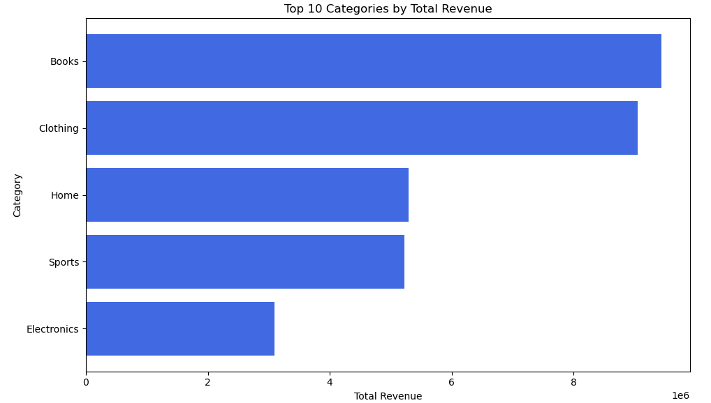

🛒 NovaMart Product Performance Analysis (Post-Pandemic)

NovaMart is a mid-sized retail company operating across Southern Africa.
After pandemic-related disruptions, management needed clarity on which products are driving revenue, which are underperforming, and how to make better product decisions going forward.

This project transforms messy product sales data into actionable insights and a reusable analysis workflow.

🧩 Business Problem

NovaMart provided a dataset of products sold over the past 18 months with the following challenges:

Missing prices due to system errors

Missing or inconsistent revenue values

Products with suspiciously low sales

No clear visibility into top performers vs underperformers

Management could not confidently answer:

Which categories generate the most revenue?

Which products should be reviewed or discontinued?

How can this analysis be repeated weekly?

🛠️ Analytical Approach

The analysis followed a structured process aligned with business needs:

Build a structured product dataset

Handle missing prices and revenue values

Identify underperforming products

Visualize top-performing categories

Design a reusable weekly analysis function

🧱 Data Structuring & Cleaning (2a, 2b)

The dataset was structured to ensure each product had:

product_name

category

units_sold

price

revenue

Missing revenue values were handled by creatively imputing revenue using price × units_sold, while tracking whether values were filled.

Cleaned & Enriched Dataset Preview

Why this matters:

Preserves as much business data as possible

Avoids dropping potentially important products

Makes downstream analysis reliable and repeatable

### Cleaned & Enriched Product Dataset

Missing prices and revenue values were handled by imputing revenue using  
`units_sold × price`, while tracking which values were filled to maintain transparency.

⚠️ Identifying Potential Underperformers (2c)

Products with:

Very low units sold

Low revenue contribution
were flagged for further review.

This allows management to:

Investigate pricing issues

Identify supply or demand problems

Decide whether to improve, reposition, or discontinue products

📈 Top-Performing Categories by Revenue (2d)

To understand what actually drives revenue, total revenue was aggregated by product category.

Key Insights:

Books and Clothing dominate total revenue

Home and Sports categories show moderate but consistent performance

Electronics contributes significantly less revenue in comparison

Business Impact:

Marketing spend can be focused on high-performing categories

Inventory strategy can prioritise revenue-driving segments

Underperforming categories can be reviewed for optimisation

### Top-Performing Categories by Total Revenue

Total revenue was aggregated by product category to identify which segments
are driving business growth post-pandemic.

🔁 Weekly Automation Function (2e)

A reusable Python function was designed to:

Load updated product data

Recalculate revenue

Flag underperformers

Regenerate summary insights

This enables NovaMart to:

Run the analysis weekly

Track performance changes over time

Make faster, data-backed decisions

(Implementation available in the src/ folder.)

📦 Project Outputs

Cleaned and enriched product dataset

Revenue-based performance insights

Visual identification of top categories

A foundation for automated weekly reporting

👤 Author

Muhammed Uwais Adam
Data Analysis | Python | Business Insights | Automation-Ready Analytics
